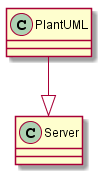

# mdBook PlantUML

mdBook preprocessor to render [PlantUML](http://plantuml.com/) code blocks as images in your book.

## Contents
- [Usage](#usage)
- [Configuration options](#options)
- [Server configuration](#example-server-configuration)
- [Troubleshooting rendering issues](#troubleshooting-rendering-issues)
- [Change log](#change-log)
- [Building/installing on Linux](#building-and-installing-on-linux)

## Usage

First create the preprocessor in your book.toml file:
```toml
[book]
authors = ["Dzjengis Khan"]
multilingual = false
src = "src"
title = "mdBook PlantUML preprocessor"

[preprocessor.plantuml]
plantuml-cmd="plantuml.exe"
```

The above assumes both the mdbook-preprocessor and the plantuml executable are on your path.

Then simply add a PlantUML code block in your book text:
````markdown
Some text here

```plantuml
@startuml
A --|> B
@enduml
```

Some more text.

````

The plantuml code block will be replaced an image reference to an SVG image if
possible, or png if PlantUML does not support svg for the requested diagram type
(i.e. ditaa).

## Options
- **plantuml-cmd:** Optional command override for PlantUML (defaults to "java -jar plantuml.jar" on Windows and "/usr/bin/plantuml" on Linux).
  When a URL is provided it is assumed you want to generate the images using a PlantUML server implementation.

## Example server configuration

Below is an example server configuration.

You can test your server by appending the URL with "/png/SoWkIImgAStDuGh8ISmh2VNrKT3LhR5J24ujAaijud98pKi1IW80".
Using the example below this example you'd end up with [this URL](http://localhost:8080/plantuml/png/SoWkIImgAStDuGh8ISmh2VNrKT3LhR5J24ujAaijud98pKi1IW80).
When it is working correctly you should see the following image:



```toml
[book]
authors = ["Dzjengis Khan"]
multilingual = false
src = "src"
title = "mdBook PlantUML preprocessor"

[preprocessor.plantuml]
plantuml-cmd="http://localhost:8080/plantuml"
```

## Troubleshooting rendering issues
mdBook communicates to the preprocessor using stdio. As a result log output
from the preprocessor is not printed to the screen. When the preprocessor's
markdown error output is insufficient for you it is posibble to redirect 
logging to the file ./output.log by using the command line switch -l. See the
config below for an example:

```toml
[book]
authors = ["Sytse Reitsma"]
multilingual = false
src = "src"
title = "mdBook E2E test book"

[preprocessor.plantuml]
plantuml-cmd="http://localhost:8080/plantuml"
command = "mdbook-plantuml -l"
```

## Change log

### 0.5.0 (2019-11-08)
* mdBook from v0.3.2 on deletes the book output directory when rendering starts,
  causing all generated preprocessor output to be deleted too. The only workaround
  at the moment is outputting the images to the src directory. This is ugly, but
  a temporary solution until mdBook allows for other ways of adding resources
  from a preprocessor.
* More thorough README.md

### 0.4.0 (2019-09-25)
* PlantUML server support, woot!
* Fixed issue where all markdown after the first PlantUML image was not
  rendered anymore (preprocessors cannot output HTML apparently).
* Images in nested chapters now have the correct URL (thanks @rafasf).
* Allow logging to file to troubleshoot preprocessor issues.

### 0.3.0 (2019-08-29)
* Generate SVG image files rather than inline svg
* For ditaa images revert to png, because PlantUML does not support svg for
  ditaa diagrams (issue #9)

### 0.2.0 (2019-07-08)
* Generated SVG image is now wrapped in a div with class type 'plantuml'
* More detailed error information when SVG generation failed (including a hint for a possible cause).

### 0.1.0 (2019-07-08)
* First version

## Building and installing on Linux
I primarily work on Windows, and rust is not that portable yet apparently.

When you get the following error while installing/building mdbook-plantuml on Linux:
```
failed to run custom build command for `openssl-sys v0.9.49`
```

Make sure you have libssl-dev and pkg-config installed:
```sh
sudo apt update
sudo apt install libssl-dev pkg-config
```
